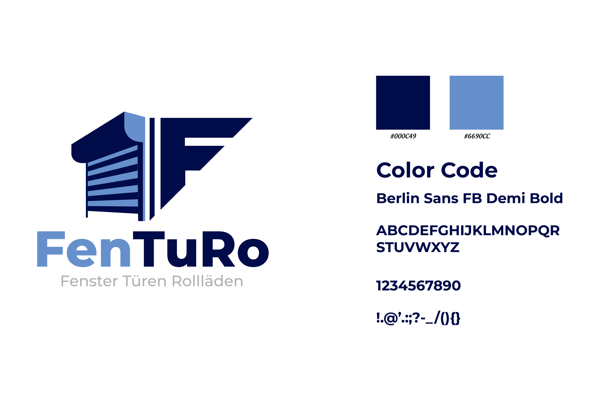

# V23 Fixes Integration Plan

## Overview
This document outlines the detailed integration plan to address 6 critical issues identified in V22 and implement V23 improvements.

---

## Issues Identified

### Issue 1: Wrong Logo File Used
**Problem:** FenTuRo-01.jpg.jpeg was used instead of Fenturo logo.jpeg
**Impact:** Incorrect branding asset displayed
**Priority:** HIGH

### Issue 2: Logo Not Added to Header
**Problem:** Logo wasn't replaced in the header, old fenstermaxx24 logo still present
**Impact:** Inconsistent branding in primary navigation
**Priority:** CRITICAL

### Issue 3: Scrolling Logo Not Replaced
**Problem:** When scrolling, logo should change to new FenTuRo logo
**Impact:** Old branding appears during scroll
**Priority:** HIGH

### Issue 4: Navigation Hover Glitch
**Problem:** Text briefly turns red during hover instead of staying black
**Impact:** Poor user experience, visual glitch
**Priority:** MEDIUM

### Issue 5: Orange Urgency Color Missing
**Problem:** Urgency color (#f37021) not implemented
**Impact:** Missing design element for calls-to-action
**Priority:** MEDIUM

### Issue 6: Homepage Hover Effects Missing
**Problem:** Navigation/header hover effects not applied throughout homepage
**Impact:** Inconsistent interaction design
**Priority:** MEDIUM

---

## Implementation Plan

### Phase 1: Logo File Processing & Replacement

**Task 1.1: Prepare Fenturo logo.jpeg**
- **Action:** Process Fenturo logo.jpeg file
- **Steps:**
  1. Read file dimensions and properties
  2. Determine optimal display size for header
  3. Note: White background removal requires image editing (PNG format preferred)
  4. For now, use as-is; recommend PNG conversion post-implementation

**Task 1.2: Replace Header Logo (Line ~2372)**
- **Current:**
  ```html
  
  ```
- **New:**
  ```html
  
  ```
- **Location:** Header section (around line 2372)

**Task 1.3: Replace Scrolling Logo**
- **Search for:** Sticky header logo implementation
- **Look for:** Logo that appears when scrolling
- **Update:** Replace with Fenturo logo.jpeg
- **Typical location:** Lines 1800-2200 (sticky/fixed header)

**Task 1.4: Find All Logo References**
- **Search pattern:** `fenstermaxx24-logo`
- **Replace all instances** with new logo
- **Verify:** No old logo URLs remain

---

### Phase 2: Navigation Hover Glitch Fix

**Task 2.1: Analyze Current Hover CSS**
- **Problem:** Text flashes red before becoming black
- **Likely cause:** CSS specificity conflict or transition timing
- **Investigation areas:**
  - Line 1121-1123: `.mainmenu > li > a:hover { color: #333333; }`
  - Check for conflicting rules with higher specificity
  - Check for color transitions
  - Check for inherited color rules

**Task 2.2: Identify Conflicting Rules**
- **Search for:**
  - Any `.mainmenu` rules with `color: red` or `color: #ff0000` or similar
  - Any `a:hover` rules affecting navigation
  - Any transition properties on navigation links
  - Any !important declarations (though we avoid these)

**Task 2.3: Fix Hover Color Consistency**
- **Solution approaches:**
  1. Add explicit color declaration to base state (not just hover)
  2. Ensure transition includes color property
  3. Remove conflicting color declarations
  4. Increase specificity if needed (without !important)

**Example fix:**
```css
/* Base state - set black color */
.mainmenu > li > a {
    color: #333333;
    transition: all 0.4s cubic-bezier(0.4, 0, 0.2, 1);
}

/* Hover state - maintain black, add effects */
.mainmenu > li > a:hover {
    color: #333333;  /* Explicitly maintain black */
    font-weight: 700;
    transform: translateY(-4px);
    /* ... other effects ... */
}
```

---

### Phase 3: Orange Urgency Color Implementation

**Task 3.1: Define Urgency Color Variable**
- **Color:** #f37021 (orange)
- **Usage:** Urgency indicators, CTAs, important actions

**Task 3.2: Identify Urgency Elements**
- **Candidates:**
  - "Jetzt bestellen" buttons
  - "Angebot anfordern" CTAs
  - Sale/discount indicators
  - Important notices
  - Action buttons

**Task 3.3: Apply Urgency Color**
- **Elements to update:**
  - Primary CTA buttons (background or text)
  - Urgency badges
  - Sale indicators
  - Action-required elements

**Example implementation:**
```css
/* Urgency color for CTAs */
.btn-primary, .btn-action, .cta-button {
    background-color: #f37021;
    color: white;
}

.btn-primary:hover {
    background-color: #d96520; /* Darker on hover */
}

/* Urgency indicators */
.badge-urgent, .sale-indicator {
    background-color: #f37021;
    color: white;
}
```

---

### Phase 4: Homepage Hover Effects Extension

**Task 4.1: Document Current Hover Effects**
- **Header hover effects:**
  - Icon scale and lift (translateY -4px)
  - Light blue shadow glow
  - Bold text
  - Drop shadows
  
- **Navigation hover effects:**
  - Text stays black
  - Bold weight
  - Lift effect
  - Light blue glow
  - Shadow beneath

**Task 4.2: Identify Homepage Elements Needing Hover**
- **Categories:**
  - Product cards
  - Category tiles
  - Image links
  - Text links
  - Buttons
  - Interactive elements

**Task 4.3: Apply Consistent Hover Styles**
```css
/* Product cards hover */
.product-card:hover {
    transform: translateY(-4px);
    box-shadow: 0 8px 16px rgba(102, 144, 204, 0.2),
                0 12px 24px rgba(0, 0, 0, 0.1);
    transition: all 0.4s cubic-bezier(0.4, 0, 0.2, 1);
}

/* Link hover effects */
.homepage-link:hover {
    color: #333333;
    font-weight: 700;
    text-shadow: 0 0 16px rgba(102, 144, 204, 0.8);
}

/* Button hover effects */
.homepage-button:hover {
    transform: translateY(-2px);
    box-shadow: 0 6px 12px rgba(102, 144, 204, 0.4);
}
```

**Task 4.4: Ensure Consistency**
- All hover effects use same timing (0.4s)
- All use same easing (cubic-bezier)
- All use light blue color (#6690CC)
- All maintain dark text color

---

## Implementation Order

### Step 1: Logo Fixes (Issues 1-3)
1. Read Fenturo logo.jpeg dimensions
2. Find all logo instances in homepage-v22.html
3. Replace header logo (line ~2372)
4. Replace scrolling logo (find sticky header)
5. Verify all old logo URLs removed

### Step 2: Navigation Hover Fix (Issue 4)
1. Analyze navigation CSS
2. Find conflicting color rules
3. Add explicit color declarations
4. Test hover behavior

### Step 3: Urgency Color (Issue 5)
1. Define color variable/usage
2. Find CTA buttons and urgency elements
3. Apply #f37021 orange color
4. Verify visibility and contrast

### Step 4: Homepage Hover Effects (Issue 6)
1. Document current effects
2. Find homepage interactive elements
3. Apply consistent hover styles
4. Test all interactions

### Step 5: Testing & Verification
1. Visual inspection of all changes
2. Test hover interactions
3. Test logo display (static and scroll)
4. Verify color scheme consistency
5. Cross-browser check

---

## Search Patterns

### Logo Replacement
```
Search: fenstermaxx24-logo
Search: FenTuRo-01.jpg
Replace with: Fenturo logo.jpeg
```

### Navigation Hover
```
Search: .mainmenu > li > a:hover
Search: color.*red
Search: transition.*color
```

### Urgency Elements
```
Search: btn-primary
Search: cta
Search: button
Search: jetzt
Search: angebot
```

### Homepage Elements
```
Search: hover
Search: card
Search: product
Search: tile
```

---

## Risk Assessment

### High Risk
- **Logo replacement:** If dimensions wrong, layout breaks
- **Mitigation:** Calculate optimal size first, test responsiveness

### Medium Risk
- **Navigation hover:** May affect existing behavior
- **Mitigation:** Test thoroughly, preserve existing effects

### Low Risk
- **Color additions:** Purely visual
- **Homepage hovers:** Non-invasive enhancements

---

## Rollback Plan

If issues occur:
1. Revert to homepage-v22.html (commit f56d8ea)
2. Address specific issue
3. Re-implement incrementally
4. Test each change independently

---

## Success Criteria

### Logo (Issues 1-3)
- ✅ Fenturo logo.jpeg used throughout
- ✅ Header logo displays correctly
- ✅ Scrolling logo displays correctly
- ✅ No old fenstermaxx24 logos remain
- ✅ Logo dimensions appropriate

### Navigation (Issue 4)
- ✅ No red flash on hover
- ✅ Text stays black throughout hover
- ✅ Smooth transition
- ✅ No visual glitches

### Urgency Color (Issue 5)
- ✅ Orange #f37021 applied to CTAs
- ✅ Good contrast and visibility
- ✅ Consistent usage throughout

### Homepage Hovers (Issue 6)
- ✅ Consistent effects across homepage
- ✅ Same timing and easing
- ✅ Light blue color scheme maintained
- ✅ Professional, polished feel

---

## Timeline Estimate

- **Logo fixes:** 30-45 minutes
- **Navigation hover fix:** 15-20 minutes
- **Urgency color:** 20-30 minutes
- **Homepage hovers:** 45-60 minutes
- **Testing:** 30 minutes
- **Total:** ~2.5-3 hours

---

## Notes

1. **Logo transparency:** White background removal requires PNG format with alpha channel. JPEG doesn't support transparency. Recommend:
   - Use Fenturo logo.jpeg as-is for V23
   - Create PNG version with transparent background for V24
   - Update logo reference in V24

2. **Navigation hover:** The red flash is likely a CSS transition issue where the default link color (red) briefly appears before the hover state applies.

3. **Orange color:** #f37021 is a strong, attention-grabbing orange perfect for urgency CTAs.

4. **Hover effects:** Should be subtle yet noticeable, maintaining the premium glassmorphism aesthetic.

---

**Status:** Ready for implementation
**Target:** homepage-v23.html
**Dependencies:** Fenturo logo.jpeg file in repository
